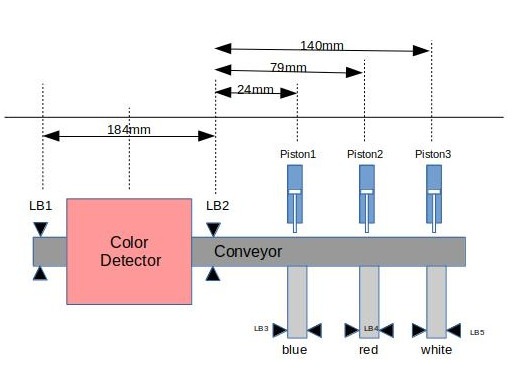

# Intro

This repository contains the code for the PRU (Programmable Realtime Unit) for the [farbsort](https://github.com/bbvch/farbsort) project. Please head there for a more general and highlevel overview over the project. 


A detailed schematic on the pin usage on the beagleboard can be found in this PDF: [doc/Diagrams/farbsort-pcb-schematic.pdf](doc/Diagrams/farbsort-pcb-schematic.pdf) 

The layout of the cape for the BeagleBoard can be found in this PDF [doc/Diagrams/farbsort-pcb-layout.pdf](doc/Diagrams/farbsort-pcb-layout.pdf) 

# Setup

A good introduction what software packages to obtain for developing can be found on http://processors.wiki.ti.com/index.php/PRU-ICSS_Getting_Started_Guide. 

__NOTE:__ Make sure that the PRU Code Generation Tools and the Linux Processor SDK (and its included software support package) are compatible with the kernel and its drivers.

A valid combination that works:
* [Debian 8.6](https://debian.beagleboard.org/images/bone-debian-8.6-lxqt-4gb-armhf-2016-11-06-4gb.img.xz)
* [CGT 2.1.4](http://software-dl.ti.com/codegen/esd/cgt_public_sw/PRU/2.1.4/ti_cgt_pru_2.1.4_linux_installer_x86.bin)
* [SDK 3.0.2](http://software-dl.ti.com/processor-sdk-linux/esd/AM335X/latest/index_FDS.html)


## PRU Code Generation Tools

Download correct version of the tools: http://software-dl.ti.com/codegen/non-esd/downloads/download.htm#PRU
give execution permission, execute
...and install to ~/prg/ti-cgt-pru_x.y.z

__NOTE:__ the execution of the installer for the PRU Code Generation Tools needs the 'Linux Standard Base core support package' which might not be installed if using ubuntu. Install it using sudo apt-get install lsb-core

## Linux Processor SDK
Download correct version of the SDK: http://www.ti.com/tool/PROCESSOR-SDK-AM335X
give execution permission, execute
...and install to ~/prg/ti-processor-sdk-linux-am335x-evm-xx.xx.xx.xx

SInce there is a broken compilation in the TI SDK, apply [this patch](0001-pru_virtio_ring-make-it-compile.patch) to the TI SDK


Adapt ```setup-ti-env.sh``` to reference the above installed software packages.

## setting up google test
google test is linked as a submodule in order to compile the linux part of the project the submodule needs to be initialized

$> git submodule init
$> git submodule update

As an additional dependency google test uses cmake

# Building

All build-artefacts are put into the `bin/` folder. The linux executable will contain the unit tests, the .pru executable will be the compiled firmware. Before a build can be started the PRU-toolchain has to be set by sourcing  ```setup-ti-env.sh```

## Building all

Building linux and pru binaries all in one go.

```
$ source setup-ti-env.sh
$ make 
```

## Building in single steps 
If only the linux code (tests) or the pru code needs to be built specify the target

```
$ source setup-ti-env.sh
$ make linux
$ make pru
```

### Building single targets
individual targets or substeps of the build can be triggered using the makefiles directly

``` 
$ source setup-ti-env.sh
$ make -f Makefile.linux <target>
$ make -f Makefile.pru <target>
```

### running tets suite
```
$ make -f Makefile.linux run-tests
```


## Installing manually on the beagle board
The following instructions should only be used to test development versions of the code on the target board, this is a shortcut to avoid rebuilding a full image every time the code changes. The steps below assume that the beagle-board is correctly set up with an appropriate SD card image built out of https://github.com/bbvch/farbsort. 

The resulting binary of running ```make -f Makefile.pru``` needs to be copied to the beagle as ```/lib/firmware/am335x-pru0-fw``` __Note:__ the exact filename including proper capitalisation is needed, or else the board will not run properly.

1. Connect the beagle board over USB and wait for it to boot and start the network stack. The blue user-LED D20 will flash a "heartbeat" pattern when ready
1. create a backup of the existing firmware by using
  1. log in on the beagle board ```$>ssh debian@192.168.7.2``` the password will be shown on the login prompt. The ip adress is the default one assumed by the beagle board when using network over USB and might change depending on the flashed image.
  1. create a backup by ```$>mkdir ~/<current_date>_firmware_backup && sudo cp /lib/firmware/amx335x-pru0 ~/<current_date>_firmware_backup/```
1. copy the new version of the firmware onto the beagle board ```scp bin/am335x-pru0-fw debian@192.168.7.2:~/```
1. log in again on the beagle board using ssh and copy the file to /lib/firmware ```sudo cp am335x-pru0-fw /lib/firmware/```
1. restart the beagle board by unplugging the usb cable (using ```reboot``` might not correctly reload the firmware code)

